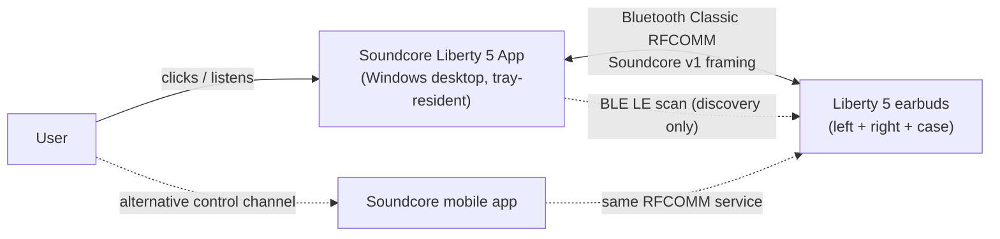
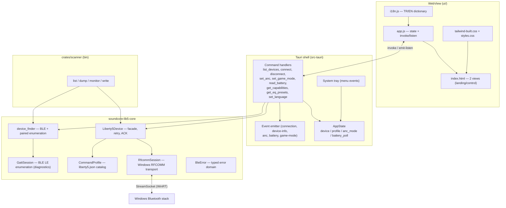
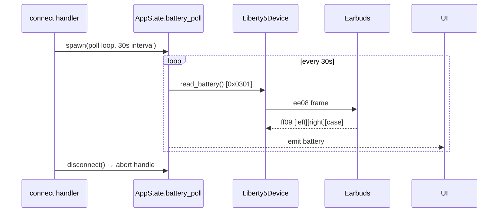
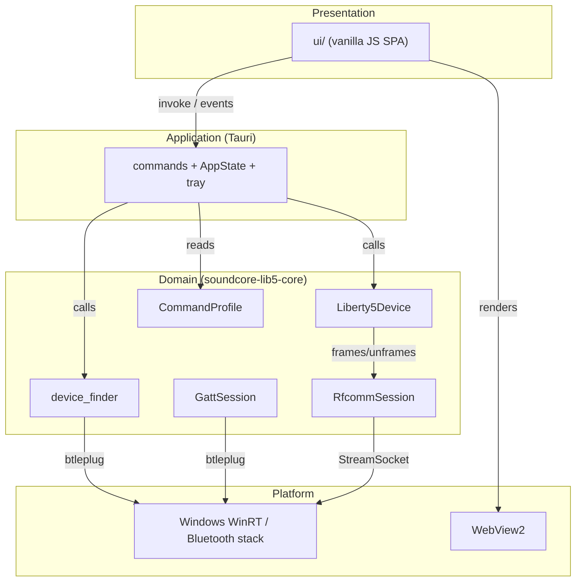
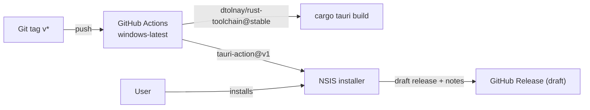

# Project Architecture Blueprint — Soundcore Liberty 5

**Generated:** 2026-08-13
**Project:** Soundcore Liberty 5 — unofficial Windows desktop controller for Anker Soundcore Liberty 5 earbuds
**Repository:** `C:/Users/Hazar/Documents/1vibec/anker`
**Workspace:** Cargo workspace (resolver 2) — `crates/soundcore-lib5-core`, `crates/scanner`, `src-tauri` + static web UI in `ui/`

---

## 1. Architecture Detection and Analysis

### 1.1 Technology Stack (detected)

| Layer | Technology | Evidence |
|---|---|---|
| Desktop shell | Tauri 2 (Rust) | `src-tauri/Cargo.toml` (`tauri = "2"`, `tray-icon` feature), `tauri.conf.json` |
| Backend language | Rust (edition 2021) | workspace `Cargo.toml`, `resolver = "2"` |
| Frontend | Vanilla HTML/CSS/JS (no framework) | `ui/index.html`, `ui/app.js`, `ui/i18n.js` |
| CSS | Tailwind CSS (build-time only) + hand-rolled glass styles | `ui/tailwind.config.js` → `tailwind-built.css`; `ui/styles.css` |
| BT Classic transport | Windows RFCOMM via WinRT (`StreamSocket`, `RfcommDeviceService`) | `crates/soundcore-lib5-core/src/rfcomm_session.rs` |
| BT LE discovery | `btleplug 0.12` + WinRT (`BluetoothLEDevice`, `DeviceInformation`) | `device_finder.rs` |
| Async runtime | tokio (multi-thread, macros, time, sync) | both Cargo.toml feature sets |
| Serialization | serde / serde_json (Tauri IPC, profile JSON, events) | workspace deps |
| Errors | thiserror (domain errors), stable string codes | `error.rs` |
| CLI tool | clap 4 (derive) — `scanner` bin | `crates/scanner/src/main.rs` |
| Distribution | NSIS installer, GitHub Actions release workflow | `tauri.conf.json`, `.github/workflows/release.yml` |

### 1.2 Architectural Pattern (detected)

**Layered / Hexagonal hybrid**, with a data-driven command catalog:

1. **Domain core** (`soundcore-lib5-core`) — device model, protocol framing, transport, discovery, profile catalog. No Tauri/web dependency. Pure Rust + Windows platform APIs.
2. **Application / orchestration** (`src-tauri/src/lib.rs`) — Tauri command handlers, shared `AppState`, session lifecycle, battery polling, system tray. Owns tokio tasks and event emission.
3. **Presentation** (`ui/`) — static SPA, two views (landing/control), i18n (TR/EN), IPC via `invoke`/`listen`.

Adaptations of the layered pattern:
- The domain core itself is split along a **transport seam** (`RfcommSession`) and a **device facade** (`Liberty5Device`) with retry/ACK logic on top — a hexagonal shape in miniature (infrastructure transport behind a thin domain-facing API).
- **Data-driven command profile**: all wire-level command bytes live in `profiles/liberty5.json` (`CommandProfile`), not in code. Code contains only verified command semantics; the profile is the single source of truth for command codes and payloads.
- **Event-driven UI refresh**: the app layer pushes state to the UI via Tauri events (`connection`, `device-info`, `anc`, `battery`, `game-mode`) rather than pull/query; UI mutates optimistically and reverts on error.

### 1.3 Key architectural boundaries

| Boundary | Enforced by |
|---|---|
| UI ↔ backend | Tauri IPC (`invoke` + typed `ApiError { code, detail }`); no DOM logic in Rust, no BLE logic in JS |
| Domain ↔ Windows APIs | `soundcore-lib5-core` owns all `windows::` / `btleplug` usage; `src-tauri` never touches them |
| Command data ↔ code | `CommandProfile` JSON + `validate()` at startup; code reads commands only through `profile.command()/payload()` |
| Verified ↔ unverified protocol | Absence from profile = locked feature; `get_capabilities` gates UI by profile content |

---

## 2. Architectural Overview

The app is a **system-tray-resident Windows controller** for one device family (Soundcore Liberty 5). The desktop process owns a single live device session guarded by a tokio `Mutex`; every command round-trips over Bluetooth Classic RFCOMM using the reverse-engineered "Soundcore v1" framing. The frontend is a phone-shaped (405×720, non-resizable) window that is a pure remote control: it renders state pushed by the backend and sends intent via typed commands.

### 2.1 Guiding principles evident in the code

- **Only verified bytes ship.** Unverified commands (EQ) are kept out of the profile and locked behind `BleError::NotSupported`; `protocol-notes.md` documents what was captured vs. what was confirmed on a real device.
- **Fail loud, recover silently.** Transport errors are retried once with a fresh session (flaky `0x800710DD`); domain errors surface to the UI with stable, i18n-mapped codes.
- **Single-threaded device access.** One `Arc<Mutex<Option<Liberty5Device>>>`; all commands serialize on it — no concurrent writes to a half-duplex RFCOMM channel.
- **Push, don't poll (except battery).** UI state is event-driven; battery is the one polled value (device reports in 10% steps, 30 s cadence).
- **Data over code for protocol.** The command catalog is JSON; adding a verified command is a profile edit + capability check, not a rewrite.
- **Deterministic window.** Fixed logical size 405×720, fullscreen forcibly reverted on resize events.

### 2.2 Architectural boundaries and enforcement

- Crate boundary: `src-tauri` depends on `soundcore-lib5-core` (path dep); core has no reverse dependency.
- State boundary: `AppState` fields are `Arc<Mutex<…>>`; no global mutable statics.
- Transport boundary: `RfcommSession` is the only type that constructs `StreamSocket`/`DataReader`/`DataWriter`; `Liberty5Device` talks to `RfcommSession`, never to WinRT.
- Discovery boundary: `device_finder.rs` is the only module using `btleplug`/WinRT enumeration; `GattSession` is the only BLE-LE access path (diagnostics).

### 2.3 Hybrid / adapted patterns

- **Mini-hexagon**: `Liberty5Device` (port) over `RfcommSession` (adapter). The port is *structurally* present but not yet a trait — `refactorplan.md` item 3 records the missing `Transport` trait seam.
- **Twin-command pattern** (`set_anc` / `set_game_mode`) — near-identical send-and-verify-ACK implementations; recorded as refactor candidate 1.

---

## 3. Architecture Visualization

### 3.1 System context (C4 L1)



### 3.2 Container diagram (C4 L2)



### 3.3 Component interaction — connect + ANC change (sequence)

```mermaid
sequenceDiagram
    participant U as UI (app.js)
    participant C as Tauri command (lib.rs)
    participant S as AppState
    participant D as Liberty5Device
    participant R as RfcommSession
    participant B as Earbuds (RFCOMM)

    U->>C: invoke("list_devices")
    C->>D: find_liberty_devices() [BLE scan 5s → paired fallback]
    C-->>U: LibertyDeviceInfo[]
    U->>C: invoke("connect", { deviceAddress })
    C->>S: abort old battery_poll; disconnect old device
    C->>D: Liberty5Device::open(profile, address)
    D->>R: RfcommSession::open(service_uuid, address)
    R->>B: connect StreamSocket (RFCOMM service 0cf12d31-…)
    C->>D: read_device_info() [0x0101]
    D->>R: command(0x0101, [])
    R->>B: ee08 frame
    B-->>R: ff09 164-byte response
    R-->>D: frames (serial [16..32], fw [6..16], anc via 0x0106)
    C-->>U: emit connection:true, device-info, anc
    C->>D: read_battery() [0x0301]
    C-->>U: emit battery
    U->>C: invoke("set_anc", { mode: "On" })
    C->>D: set_anc(On) → command(0x8106, 001000010001)
    R->>B: ee08 frame
    B-->>R: ff09 ACK (0x8106, empty payload)
    D-->>C: Ok (ACK verified)
    C-->>U: emit anc:"On"
```

### 3.4 Battery polling (sequence)



### 3.5 Wire frame layout (Soundcore v1, verified)

```
Host → device:  08 ee | 00 00 | 00 | cmd u16-LE | len u16-LE | payload | checksum
Device → host:  09 ff | 00 00 | 01 | cmd u16-LE | len u16-LE | payload | checksum
len = full frame length; payload = len − 10; checksum = sum of all preceding bytes
```

---

## 4. Core Architectural Components

### 4.1 `soundcore-lib5-core` (domain crate)

#### `Liberty5Device` — device facade (`liberty5_device.rs`)

- **Responsibility**: high-level device operations: `open`, `read_device_info` (0x0101 serial/firmware + 0x0106 ANC mode), `set_anc` (0x8106), `set_game_mode` (0x8510), `read_battery` (0x0301), `monitor`, `send_raw` (protocol discovery), `disconnect`.
- **Internal structure**: owns `Option<RfcommSession>`, `Arc<CommandProfile>`, device address string. Lazy session (re)open via `ensure_session()`.
- **Key pattern — retry with session re-open** (`command()`): the device closes the RFCOMM channel after responding; the next write fails with `0x800710DD`. On any transport error the session is dropped, re-opened after `RETRY_DELAY` (1.5 s), and the command is attempted a second time.

```rust
async fn command(&mut self, command: u16, payload: &[u8]) -> Result<Vec<Frame>, BleError> {
    let mut attempts = 0;
    loop {
        attempts += 1;
        if self.session.is_none() {
            self.session = Some(RfcommSession::open(
                &self.profile.control_service_uuid, &self.device_address).await?);
        }
        match self.session.as_mut().expect("oturum açık").command(command, payload).await {
            Ok(frames) => return Ok(frames),
            Err(_error) if attempts < 2 => {
                self.session = None;
                tokio::time::sleep(RETRY_DELAY).await;
            }
            Err(error) => return Err(error),
        }
    }
}
```

- **Key pattern — ACK verification**: commands return frames; `set_anc`/`set_game_mode` require a response frame with the same command code and empty payload, else `BleError::Connection` (recorded duplicate — refactor candidate 1).

```rust
let frames = self.command(command_code, &payload).await?;
if frames.iter().any(|f| f.command == command_code && f.payload.is_empty()) {
    Ok(())
} else {
    Err(BleError::Connection("ANC komutuna onay alınamadı".to_string()))
}
```

- **Evolution**: `set_eq_preset` is a locked stub (`Err(BleError::NotSupported)`) — EQ intentionally deferred (user decision, `protocol-notes.md`; refactor candidate 4).

#### `RfcommSession` — Windows RFCOMM transport (`rfcomm_session.rs`)

- **Responsibility**: open a WinRT `StreamSocket` to the device's control service (UUID `0cf12d31-fac3-4553-bd80-d6832e7b3957`), frame/unframe Soundcore v1 packets, read with a deadline.
- **Internal structure**: `DataReader` + `DataWriter` over the socket; constants for markers (`0xee08` host / `0xff09` device), direction bytes, `HEADER_LENGTH = 9`.
- **Interaction**: `open(service_uuid, device_address)` → device enumeration via `RfcommDeviceService::GetDeviceSelector` → address matching (normalized: lowercase, stripped `:`) → `ConnectAsync`. `command()` writes a frame then `read_until(3s, frame.command == cmd)` (the device ACK completes the read early). `read_until` streams 1024-byte loads with remaining-time timeouts and extracts frames.
- **Key pattern — resilient unframing** (`take_frame`): byte-at-a-time realignment on marker mismatch, drops frames on failed checksum. Pure function — unit-tested against captured wire bytes.
- **Evolution**: the natural home for the `Transport` trait seam proposed in `refactorplan.md` (item 3).

#### `CommandProfile` — data-driven command catalog (`command_profile.rs`, `profiles/liberty5.json`)

- **Responsibility**: single source of truth for verified command codes, payload hex, service UUID, device name pattern.
- **Structure**: `{ deviceNamePattern, controlServiceUuid, eqPresets, commands: { deviceInfo, anc, gameMode, battery } }` where each command maps `option → payload hex` (`""` = empty payload).
- **Key patterns**:
  - `embedded()` — `include_str!` compile-time embedding; `validate()` at startup (non-nil service UUID, non-zero command codes, hex payloads parse).
  - `payload(kind, option)` → decoded `Vec<u8>` or `BleError::Profile` — the only code path that turns profile bytes into wire bytes.
  - Absence in profile = feature unavailable (`command("eqPreset").is_none()`); capability gating derives directly from it.
- **Verified commands**: `deviceInfo` 0x0101, `anc` 0x8106 (On `001000010001` / Transparency `011000010001` / Off `021000010001`), `gameMode` 0x8510 (On `01` / Off `00`), `battery` 0x0301 (request `""`).

#### `device_finder` — discovery (`device_finder.rs`)

- **Responsibility**: find Liberty-named devices; resolve a query to a `DiscoveredDevice`; fall back to the Windows paired-device list when the device is not advertising.
- **Key patterns**:
  - **Name filter**: case-insensitive `contains("liberty")` on local/advertisement names.
  - **Name enrichment cascade**: advertised name → WinRT cached name (`BluetoothLEDevice::FromBluetoothAddressAsync`) → temporary GATT connect (2 s timeout) to refresh btleplug properties → `"Bluetooth {address}"` fallback.
  - **Discovery fallback**: scan adapters first (`collect_liberty` per adapter, `merge_unique` by `device_id`); if empty, `start_scan` 5 s, collect, stop scan.
  - **Paired fallback** (`find_liberty_devices`): BLE advertising first; else `paired_liberty_devices()` — WinRT enumeration of paired classic (BR/EDR) and LE devices, dedupe by name (classic preferred), address via `BluetoothAddress`.
- **Data**: `LibertyDeviceInfo { device_id, name, address, connected }` (camelCase-serialized for IPC).

#### `GattSession` — BLE LE diagnostics (`gatt_session.rs`)

- **Responsibility**: connect, `discover_services`, enumerate characteristics with property names and read hex values, read/write/subscribe/disconnect. Used for protocol exploration (the control channel is RFCOMM, not LE — `protocol-notes.md`).
- **Status**: diagnostic surface, not part of the app's runtime control path.

#### `BleError` — typed error domain (`error.rs`)

- Seven variants: `Bluetooth` (btleplug), `NotFound`, `NotSupported`, `Profile`, `InvalidAncMode`, `Connection` (user-actionable message), `Windows` (WinRT).
- **Key pattern — stable codes**: `code() → &'static str` (`ble`, `not_found`, `not_supported`, `profile`, `invalid_anc`, `connection`, `windows`) + `detail()`; serialized as `ApiError { code, detail }` over IPC and mapped to i18n keys in the UI.

### 4.2 `src-tauri` — application shell

#### Command handlers (`lib.rs`)

| Command | Action | Events emitted |
|---|---|---|
| `list_devices` | `find_liberty_devices()` | — |
| `connect` | abort poll → disconnect old → `open` → `read_device_info` → set `anc_mode` → store → first battery read → spawn poll | `connection:true`, `device-info`, `anc`, `battery` |
| `disconnect` | abort poll → `disconnect` → take device | `connection:false` |
| `set_anc` | parse mode → device call → update `anc_mode` | `anc` |
| `set_game_mode` | device call | `game-mode` |
| `set_eq_preset` | device stub (`NotSupported`) | — |
| `read_battery` | device call | `battery` |
| `get_eq_presets` | profile `eq_presets` (empty today) | — |
| `get_capabilities` | derive `anc`/`game_mode`/`eq_preset` from profile | — |
| `set_language` | rebuild tray menu labels | — |

#### `AppState` — shared state

```rust
pub struct AppState {
    pub device: Arc<Mutex<Option<Liberty5Device>>>,
    pub profile: Arc<CommandProfile>,
    pub anc_mode: Arc<Mutex<AncMode>>,
    pub battery_poll: Arc<Mutex<Option<tokio::task::JoinHandle<()>>>>,
}
```

- Concurrency model: tokio `Mutex`; the device guard is held across network I/O (serializes all device access).
- Lifecycle rule (currently repeated in `connect`, `disconnect`, tray "disconnect"): abort poll → take+disconnect device → emit `connection:false`. Recorded as refactor candidates 2 + 5.

#### Battery polling

- `BATTERY_POLL_SECONDS = 30`; poll loop is `tokio::spawn`ed in `connect`; handle stored in `AppState.battery_poll`; aborted on disconnect/connect/reconnect. Poll errors are swallowed (`read_battery().await.ok()`); disconnect mid-poll breaks the loop (`None => break`).

#### System tray

- `TrayIconBuilder::with_id("main")`, `show_menu_on_left_click(false)`.
- Menu: Show Window / Disconnect / Cycle ANC (Off→Transparency→On) / Quit; labels rebuild on language change via `set_language`.
- Window policy: fixed 405×720 logical size, non-resizable, fullscreen reverted on `Resized` events; closing the window does not exit (tray-resident app).

### 4.3 `ui/` — presentation

- **`app.js`** — single IIFE; `state` object mirrors device state; `invoke`/`listen` from `window.__TAURI__` (withGlobalTauri). Optimistic UI mutations with revert on error; `fmtError` maps `ApiError.code` → `I18n.t("errors.<code>")`.
- **Views**: `view-landing` (device list, connect) ↔ `view-control` (battery, ANC segmented control, game mode switch, EQ select, device meta) — `setConnected()` switches.
- **Capability gating**: `updateControlAvailability()` disables controls from `state.features` (from `get_capabilities`) — EQ additionally requires non-empty presets.
- **Event subscription**: `bindListeners()` at init — `battery`, `connection`, `anc`, `game-mode`, `device-info`, `device-error`.
- **`i18n.js`** — TR/EN dictionaries, `localStorage` persistence (`ui.lang`), `data-i18n` static application, `i18n:change` event, syncs to tray via `set_language` invoke.
- **`index.html`** — phone-shaped layout, glassmorphism design tokens (inline styles + Tailwind), Material Symbols + Google Fonts (runtime CDN for fonts only — Tailwind is pre-built).

### 4.4 `crates/scanner` — CLI tool

- Subcommands: `list`, `dump <device>`, `monitor <device> [seconds]`, `write <device> <cmd-hex> <payload-hex> --force` (confirmation-gated experimental command sender).
- Uses the same core facade (`Liberty5Device::open`, `read_device_info`, `send_raw`) — the "probe" face of the domain crate.

---

## 5. Architectural Layers and Dependencies



**Dependency rules (as implemented):**

- UI → application → domain → platform; no skip layers (UI never touches WinRT; commands never touch the socket).
- `RfcommSession` and `device_finder`/`GattSession` are the only platform-touching types; `Liberty5Device` depends on `RfcommSession` + `CommandProfile` only.
- `scanner` is a sibling consumer of the domain crate — it exercises the same facade as the app (no UI dependency).

**Violations / notes:**

- No circular dependencies detected in the Rust graph.
- Layer separation is by module discipline, not compiler-enforced (no trait seam for the transport — `refactorplan.md` item 3).
- The "twin command" duplication (`set_anc`/`set_game_mode`) and three copies of the close-session sequence are the two concrete maintenance risks (`refactorplan.md` items 1–2).

---

## 6. Data Architecture

### 6.1 Domain model

| Type | Fields | Notes |
|---|---|---|
| `LibertyDeviceInfo` | `device_id`, `name`, `address`, `connected` | camelCase over IPC |
| `BatteryStatus` | `left/right/case: Option<u8>` | percent = `(value+1)*10`, verified `09 06 06 → 100/70/70` |
| `DeviceInfo` | `serial`, `firmware`, `anc_mode` | serial `[16..32]`, firmware `[6..11]+[11..16]` of the 164-byte 0x0101 reply; dedup logic `fw1 == fw2 ? fw1 : "fw1/fw2"` |
| `AncMode` | `Off/Transparency/On` | wire bytes `0x02/0x01/0x00`; `parse`/`as_str`/`from_mode_byte` |
| `Frame` | `command: u16`, `payload: Vec<u8>` | unframed device frames |
| `CommandProfile` / `ProfileCommand` | command map `option → payload hex` | data-driven catalog |
| `ApiError` | `code: &'static str`, `detail: String` | IPC error envelope |

### 6.2 Data access patterns

- **No persistence layer.** The only stored state is the UI language (`localStorage` key `ui.lang`). No database, no config files, no caching layer.
- Device data flows as **event payloads** (JSON) from backend to UI; UI state is a mirror (`state` object), not a store.
- **Profile access pattern**: `profile.payload(kind, option)` is the single read path; startup `validate()` guarantees invariants (non-zero codes, parseable hex, non-nil service UUID).

### 6.3 Data transformation / mapping

- **Hex ↔ bytes**: payload strings in profile ↔ `Vec<u8>` via `hex::decode`; values emitted as JSON (serde `rename_all = "camelCase"`).
- **Battery**: raw nibble-ish byte → `(v + 1) * 10` percent, guarded `u8::try_from` (values above 24 overflow → `None`).
- **Device info**: fixed offsets into the 164-byte 0x0101 payload; UTF-8 lossy string extraction.
- **Address normalization**: lowercase + strip `:` for matching (`rfcomm_session`), `{:012x}` formatting in WinRT property lookup, `{:02X}:…` grouping for display (`device_finder`).

### 6.4 Validation

- Profile: structural validation at startup (`CommandProfile::validate`); runtime payload lookups return `BleError::Profile` on missing kind/option.
- UI input: address validity check (`validAddress` — non-empty, not `"—"`), mode strings parsed by `AncMode::parse` → `BleError::InvalidAncMode`.
- Battery decode unit-tested against verified device values (`09 06 06 → 100/70/70`, `00 01 05 → 10/20/60`).

---

## 7. Cross-Cutting Concerns Implementation

### 7.1 Authentication & Authorization

- **None by design.** Single-user local desktop app controlling a local Bluetooth device. No network surface, no identity, no permissions beyond OS-level Bluetooth consent (Windows pairing happens in the OS, outside the app). The RFCOMM service is selected by fixed UUID; no pairing logic in code.

### 7.2 Error Handling & Resilience

- **Domain error taxonomy**: 7 typed `BleError` variants with `code()`/`detail()` (see 4.1).
- **Transport retry**: `Liberty5Device::command` retries once after 1.5 s with a fresh session on any transport error — addresses the verified flaky `0x800710DD` (device closes channel after each response).
- **ACK handshake**: `set_anc`/`set_game_mode` fail with `BleError::Connection` if the same-command empty-payload ACK is not seen within the 3 s read window.
- **Graceful degradation**: battery poll errors are swallowed (`ok()`), polling continues; poll loop exits cleanly when the device is dropped; disconnect errors during teardown are ignored (`let _ =`).
- **User-actionable error copy**: `BleError::Connection` carries remediation guidance ("close the Soundcore app on the phone; unpair/repair on Windows") surfaced verbatim through `detail`.
- **No circuit breaker / backoff beyond the single retry** — deliberate: the RFCOMM channel is inherently one-shot, retry is the recovery.

### 7.3 Logging & Monitoring

- **`eprintln!` only** — retry path logs `[retry] komut=0x{…} hatasi: …`. No structured logging, no observability hooks, no crash reporting. Consistent with a hobby-scale, single-user app; the CLI tool is the diagnostic surface (`scanner dump/monitor`).
- UI errors surface via `#control-notice`/`#landing-status` (aria-live polite).

### 7.4 Validation

- Two-level: Rust-side (typed modes, profile-validated payloads) and UI-side (address validity, optimistic revert on failure). Business rules live in the domain (`AncMode::parse`, battery decode), not in the UI.

### 7.5 Configuration Management

- **Embedded profile JSON** (`include_str!`) — the only "configuration"; immutable at runtime, validated at startup.
- **UI language** — `localStorage`, synced to tray at startup and on switch.
- **No environment-specific config, no secrets, no feature flags.** Tauri window/version config lives in `tauri.conf.json` (product name, identifier `com.vibec.soundcore-liberty5`, window geometry, NSIS bundling).

---

## 8. Service Communication Patterns

### 8.1 Device boundary (Bluetooth Classic)

- **Protocol**: Soundcore v1 framing over RFCOMM (service UUID `0cf12d31-fac3-4553-bd80-d6832e7b3957`). Not BLE — the LE stack exposes only generic services; the app uses LE only for discovery/enumeration.
- **Synchronous request/response**: each command write is followed by reads until a matching command frame (the ACK) arrives or a 3 s deadline expires; reads collect all frames in the window (e.g., 0x0101 response + 0x0106 notification).
- **One-shot channel**: the device closes the RFCOMM channel after responding — the next write fails (`0x800710DD`), recovered by session re-open + retry.
- **Asymmetric framing**: host packets start `08 ee`, device packets `09 ff`; direction byte 0x00/0x01; single-byte additive checksum.
- **Versioning**: none (protocol discovery is manual, documented in `protocol-notes.md`; `scanner write --force` is the experimental path).

### 8.2 Application boundary (Tauri IPC)

- **Command style**: async `#[tauri::command]` handlers; typed results or `ApiError { code, detail }`.
- **Event style**: backend→UI push (`app.emit`) — `connection`, `device-info`, `anc`, `battery`, `game-mode`; UI subscribes once (`listen`) at init.
- **Synchronous vs async**: all device operations async (tokio); UI awaits `invoke` and applies optimistic updates.
- **Capability advertisement**: `get_capabilities` tells the UI which features exist; UI disables the rest (EQ is currently disabled end-to-end).

---

## 9. Technology-Specific Architectural Patterns

### 9.1 Rust patterns

- **`Arc<Mutex<…>>` shared state** with tokio async mutexes — all AppState fields; device access serialized by design (half-duplex channel).
- **`thiserror` domain errors** with stable string codes for IPC stability.
- **Compile-time data embedding** (`include_str!`) for the command catalog.
- **cfg-gated platform code**: `#[cfg(windows)]` sections in `device_finder` (paired enumeration, WinRT cached names) with non-Windows stubs; `#![cfg_attr(windows, windows_subsystem = "windows")]` in the Tauri entry.
- **Module privacy discipline**: only `lib.rs` re-exports the public API surface.

### 9.2 Tauri patterns

- `tauri::generate_handler!` registry; `Builder::default().setup(build_tray).run(...)`; `app.manage(AppState::new(...))` in setup; tray menu events spawn async runtime tasks via `tauri::async_runtime::spawn`.
- `withGlobalTauri: true` — frontend accesses `window.__TAURI__.core.invoke` / `.event.listen` (no npm sidecar).
- **Window policy in code**: `on_window_event` enforces 405×720 and reverts fullscreen — app logic compensating for `tauri.conf.json` declarative limits.

### 9.3 Windows Bluetooth patterns

- **WinRT RFCOMM**: `RfcommServiceId::FromUuid` → `GetDeviceSelector` → `DeviceInformation::FindAllAsyncAqsFilter` → `RfcommDeviceService::FromIdAsync` → `StreamSocket::ConnectAsync`; `DataReader`/`DataWriter` with `InputStreamOptions::Partial`.
- **WinRT enumeration**: `BluetoothDevice`/`BluetoothLEDevice` pairing-state selectors; address extraction via `BluetoothAddress()`; cached-name lookup `BluetoothLEDevice::FromBluetoothAddressAsync`.
- **btleplug**: `Manager` → `Adapter` → `Peripheral` scan/properties/connect — used only for discovery and LE diagnostics.
- **Address matching normalization**: lowercase + `:` stripped on both sides of RFCOMM device matching; 12-hex formatting for WinRT property lookups.

---

## 10. Implementation Patterns

### 10.1 Command send + ACK verification (device domain)

```rust
// liberty5_device.rs — twin commands (refactor candidate 1)
let payload = self.profile.payload("anc", mode.as_str())?;
let command_code = self.profile.command("anc").ok_or(BleError::NotSupported)?.command;
let frames = self.command(command_code, &payload).await?;
if frames.iter().any(|frame| frame.command == command_code && frame.payload.is_empty()) {
    Ok(())
} else {
    Err(BleError::Connection("ANC komutuna onay alınamadı".to_string()))
}
```

### 10.2 Frame building / unframing (transport)

```rust
// rfcomm_session.rs — wire-order-exact host frame
fn host_frame(command: u16, payload: &[u8]) -> Vec<u8> {
    let mut bytes = Vec::with_capacity(HEADER_LENGTH + payload.len() + 1);
    bytes.push(0x08);
    bytes.push(START_OF_PACKET_HOST);              // 0xee
    bytes.extend_from_slice(&[0x00, 0x00, DIRECTION_HOST]);
    bytes.extend_from_slice(&command.to_le_bytes());
    bytes.extend_from_slice(&((HEADER_LENGTH + payload.len() + 1) as u16).to_le_bytes());
    bytes.extend_from_slice(payload);
    let checksum = bytes.iter().fold(0u8, |sum, b| sum.wrapping_add(*b));
    bytes.push(checksum);
    bytes
}
```

### 10.3 Shared-state command handler (application)

```rust
// lib.rs — serialize on the device mutex, push state via event
#[tauri::command]
async fn set_anc(state: State<'_, AppState>, mode: String, app: AppHandle) -> Result<(), ApiError> {
    let mode = AncMode::parse(&mode).map_err(api_error)?;
    let mut guard = state.device.lock().await;
    let device = guard.as_mut().ok_or_else(ApiError::not_connected)?;
    device.set_anc(mode).await.map_err(api_error)?;
    *state.anc_mode.lock().await = mode;
    let _ = app.emit("anc", mode.as_str());
    Ok(())
}
```

### 10.4 Capability-gated UI (presentation)

```js
// app.js — feature flags from profile content
function updateControlAvailability() {
    document.querySelectorAll("[data-anc]").forEach((b) => {
        b.disabled = !state.connected || !state.features.anc;
    });
    if ($("game-mode")) $("game-mode").disabled = !state.connected || !state.features.gameMode;
    if ($("eq")) $("eq").disabled = !state.connected || !state.features.eqPreset || !state.hasPresets;
}
```

---

## 11. Testing Architecture

| Scope | Location | Covers |
|---|---|---|
| Wire framing | `rfcomm_session.rs` unit tests | `host_frame` byte-exact against captured ANC-on and device-info packets; device frame parsing + checksum rejection |
| Battery decode | `liberty5_device.rs` unit tests | verified `09 06 06 → 100/70/70`; low-value edge `00 01 05 → 10/20/60` |
| Profile catalog | `command_profile.rs` unit tests | embedded profile parses; command codes/payloads match verified values; missing command → not supported; invalid hex → `Profile` error |

**Boundaries**: tests are pure-function only (no transport seam yet — `refactorplan.md` item 3: retry loop, ACK verification, device-info offset parsing are untested because `Liberty5Device` is hard-wired to `RfcommSession`). No integration tests; **verification is manual against the real device** (documented runs: 4/4 connect → device-info → 3× ANC, per `protocol-notes.md`). No mock/test-double framework in use.

**Test strategy aligned with architecture**: unit tests pin the protocol invariants that are cheap to test without hardware (framing, checksum, decode, profile); everything requiring the device stays manual until the transport trait exists.

---

## 12. Deployment Architecture



- **Artifact**: NSIS installer (`target/release/bundle/nsis/`), built by `cargo tauri build`.
- **CI**: `.github/workflows/release.yml` — triggered on `v*` tags; `windows-latest` runner; `tauri-action@v1` with `projectPath: src-tauri`; draft release with generated release notes; `GITHUB_TOKEN` write permission.
- **Runtime topology**: single Windows desktop process; WebView2 for UI; Bluetooth Classic RFCOMM to the earbuds; tray-resident (close ≠ exit).
- **Environment adaptations**: none — one target OS (Windows), no multi-env config, no cloud services, no containers.
- **Identifier**: `com.vibec.soundcore-liberty5`; versioned in lockstep (`0.4.1` in `tauri.conf.json` + Cargo.toml).

---

## 13. Extension and Evolution Patterns

### 13.1 Adding a new verified command (the main extension path)

1. **Profile**: add `commands.<kind>` with command code + option→payload hex to `profiles/liberty5.json` (and `eqPresets` if relevant). Add a profile test pinning codes/payloads.
2. **Domain**: add a method on `Liberty5Device` (send + ACK verify — reuse the twin-command shape; ideally after refactor candidate 1 extracts `send_and_await_ack`).
3. **Application**: register a `#[tauri::command]`, add to `generate_handler!`, extend `FeatureAvailability` + `get_capabilities`, emit an event.
4. **UI**: add control + event listener; capability gating picks it up automatically.
5. **Verify** on real device; record in `protocol-notes.md`; update this blueprint.

### 13.2 Unlocking EQ (currently locked)

- `set_eq_preset` stub returns `NotSupported`; `eqPresets` is `{}`; UI disables `#eq`. Unlock order: capture preset id→name mapping, add profile entries, replace stub, keep aural verification record (`protocol-notes.md` — deliberately deferred by user decision).

### 13.3 Transport seam (when the codebase grows)

- Extract `Transport` trait (`command() -> Result<Vec<Frame>, BleError>`) over `RfcommSession`; inject into `Liberty5Device::open`; fake transport enables testing retry/ACK/offset parsing (`refactorplan.md` item 3). Deliberately deferred: one real adapter today ("two adapters = real seam" principle).

### 13.4 Integration with other devices

- `device_name_pattern` in the profile ("soundcore Liberty 5") gates discovery; a second device family would be a second profile + pattern, not a rewrite — the finder already filters by name and the facade is profile-driven.

### 13.5 Deprecation / removal pattern

- EQ UI chain (select + invoke + command) can be removed wholesale and re-added later (refactor candidate 4 option b); today it is a documented dead end (`NotSupported`), safe because the UI disables it.

---

## 14. Architectural Pattern Examples

**Layer separation (domain vs. platform):**

```rust
// RfcommSession is the ONLY type touching StreamSocket/WinRT.
// Liberty5Device never sees a socket — it sees frames.
pub struct RfcommSession { reader: DataReader, writer: DataWriter, _socket: StreamSocket }

// Usage in the facade:
let frames = self.session.as_mut().expect("oturum açık").command(command, payload).await?;
```

**Event-driven component communication (app → UI):**

```rust
let _ = app.emit("battery", &status);   // push, not pull
```

```js
await listen("battery", showBattery);   // subscribed once at init
```

**Extension point — capability gate:**

```rust
fn has(kind: &str) -> bool {
    state.profile.command(kind).map(|c| !c.payloads.is_empty()).unwrap_or(false)
}
```

**Configuration-driven behavior (profile as policy):**

```rust
let payload = self.profile.payload("anc", mode.as_str())?;  // bytes come from JSON, not code
```

---

## 15. Architectural Decision Records

| # | Decision | Context | Consequence |
|---|---|---|---|
| ADR-1 | **RFCOMM (BT Classic) as control channel, BLE for discovery only** | Protocol capture showed control service is RFCOMM `0cf12d31-…`; LE exposes only generic services | `rfcomm_session.rs` owns the channel; `gatt_session.rs` is diagnostics; discovery does both |
| ADR-2 | **Data-driven command catalog (JSON) with verified-bytes-only policy** | Unverified bytes caused rejected commands (`0x8701`); aural/visual verification is slow | Profile is source of truth; unverified features are absent → locked; `validate()` at startup |
| ADR-3 | **Retry-once with session re-open for transport errors** | Device closes channel after each response; flaky `0x800710DD` observed | `Liberty5Device::command` hides transport churn; 1.5 s delay; single retry (no infinite loops) |
| ADR-4 | **ACK verification as the success contract** | Every verified command replies with same-code empty-payload ACK | `set_anc`/`set_game_mode` fail loudly on missing ACK; `read_until` 3 s deadline |
| ADR-5 | **Single serialized device access via tokio Mutex** | Half-duplex channel; concurrent writes would corrupt framing | All commands lock the same guard; simple, correct, adequate for one user |
| ADR-6 | **Event-push UI with optimistic updates** | Tauri events + vanilla JS; no framework | UI mirrors backend state; reverts on error; capability gating from profile |
| ADR-7 | **Tray-resident single-window app (405×720 fixed)** | Phone-style controller for earbuds | Close ≠ exit; fullscreen reverted in code; deterministic layout |
| ADR-8 | **EQ deferred (locked stub)** | `0x8703`/`0x8110` capture, but no aural verification; user decision | `set_eq_preset` → `NotSupported`; UI disabled end-to-end; documented in `protocol-notes.md` |
| ADR-9 | **No transport trait yet** | Single adapter (real device); "one adapter = hypothetical seam" | Retry/ACK logic untested; refactor candidate 3 gated on growth |
| ADR-10 | **Stable error codes over IPC** | `BleError` variants mapped to `code`/`detail`; UI maps to i18n | Stable frontend contract; user-actionable `Connection` copy |

---

## 16. Architecture Governance

- **Documentation-driven**: `docs/protocol-notes.md` is the protocol authority (verified vs. unverified, real-device runs); `refactorplan.md` is the recorded architecture backlog (5 candidates, prioritized, with "why not now" rationale).
- **Automated checks today**: startup `CommandProfile::validate()`; pure-function unit tests pinning wire format and decode invariants (framing, checksum, battery, profile codes).
- **Review process**: manual, real-device verification runs documented in protocol notes (e.g., 4/4 connect→info→ANC); the CLI (`scanner`) is the probe tool for experiments.
- **Consistency mechanics**: new commands must flow profile → domain → command → capability → UI event in order (section 13.1); unverified bytes never enter the profile.

---

## 17. Blueprint for New Development

### 17.1 Development workflow (by feature type)

| Feature type | Starting point | Sequence |
|---|---|---|
| New verified device command | `profiles/liberty5.json` → `liberty5_device.rs` | profile → facade method → command handler → capability → UI control → real-device verification |
| New discovery source | `device_finder.rs` | add collector, merge via `merge_unique`, wire into `find_liberty_devices` fallback chain |
| New UI control | `ui/index.html` + `ui/app.js` | markup → state field → `bindUiEvents` → `bindListeners` → capability gate → i18n keys (TR+EN) |
| New transport / adapter | `rfcomm_session.rs` (or new `Transport` impl after refactor 3) | keep `Frame` contract; facade unchanged |
| Tray action | `lib.rs` `build_tray` + `tray_menu` | menu item → `on_menu_event` match arm → shared-state operation |

### 17.2 Implementation templates

- **New command method** (domain):

```rust
pub async fn set_<feature>(&mut self, <arg>) -> Result<(), BleError> {
    let payload = self.profile.payload("<kind>", <option>)?;
    let command_code = self.profile.command("<kind>").ok_or(BleError::NotSupported)?.command;
    let frames = self.command(command_code, &payload).await?;
    if frames.iter().any(|f| f.command == command_code && f.payload.is_empty()) {
        Ok(())
    } else {
        Err(BleError::Connection("<Feature> komutuna onay alınamadı".to_string()))
    }
}
```

- **New command handler** (application): `#[tauri::command] async fn` → lock device → call facade → update state → `app.emit("<event>", value)`; register in `generate_handler!`; extend `FeatureAvailability` + `get_capabilities`.
- **New UI control**: disabled unless `state.connected && state.features.<x>`; optimistic update with revert in `catch`; label via `data-i18n` + both dictionaries.
- **New profile entry**: hex payloads only after real-device verification; add pinning unit test (`embedded_profile_parses_verified_*_commands` style).

### 17.3 Common pitfalls to avoid

- **Writing unverified bytes to the profile** — violates the verified-only policy (ADR-2); use `scanner write --force` + protocol notes instead.
- **Concurrent device access** — always take the shared `device` mutex; never spawn a task that calls the facade without the lock.
- **Second command on a closed channel** — rely on `Liberty5Device::command` retry; don't add custom reconnect logic in command handlers.
- **Skipping the capability gate** — controls must stay disabled until `get_capabilities` proves the feature exists (EQ trap).
- **Duplicating session teardown** — keep the abort-poll → disconnect → emit sequence in one place (refactor candidates 2/5) rather than a fourth copy.
- **Testing blind spots** — session logic (retry/ACK/offsets) is currently untested; when adding behavior there, prefer extracting a pure/testable seam over raw WinRT code.

### 17.4 Keeping this blueprint current

Regenerate or update this document when: a new command/profile entry ships (section 13.1), the transport seam lands (refactor 3), EQ unlocks (13.2), or any ADR in section 15 is superseded. The `architecture-blueprint-generator` skill (`npx skills add github/awesome-copilot@architecture-blueprint-generator`) regenerates this file from the current codebase state.
